# How to create a machine

A `StateMachine a b` is a stateful process which receives inputs of type `a` and emits outputs of type `b`.

We will represent a machine as such

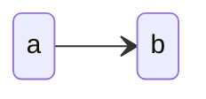

as arrows between inputs, on the left, and outputs, on the right.

The `StateMachine a b` data type has six constructors which we can use to construct a machine:

- `Basic`
- `Sequential`
- `Parallel`
- `Alternative`
- `Feedback`
- `Kleisli`

Let's start with the last five.

## `Sequential`

```haskell
Sequential
  :: StateMachine a b
  -> StateMachine b c
  -> StateMachine a c
```

allows us to sequentially compose two machines

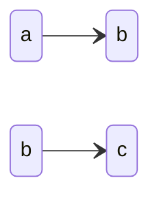

to get a single machine

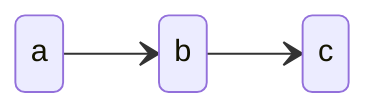

where every output `b` of the first machine is passed as an input to the second machine.

## `Parallel`

```haskell
Parallel
  :: StateMachine a b
  -> StateMachine c d
  -> StateMachine (a, c) (b, d)
```

allows us to execute two machines in parallel

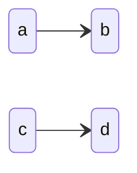

to get a single machine

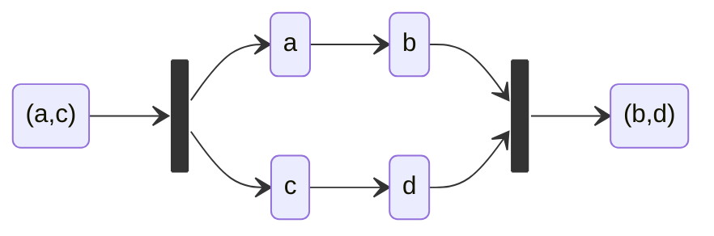

which passes the first element of the input tuple to the first machine and the second element to the second machine, collects the outputs and emits them together in a tuple.

## `Alternative`

```haskell
Alternative
  :: StateMachine a b
  -> StateMachine c d
  -> StateMachine (Either a c) (Either c d)
```

allows us to execute one out of two machines, depending on the input.

If we have two machines


we can compose them like so

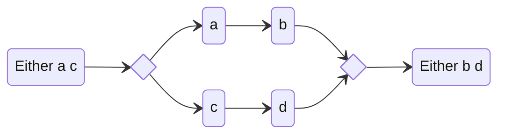

In practice, if the composed machine receives a `Left a` as input, the `a` will be passed as input to the first machine that will emit a `b`, which will be wrapped to emit a `Left b` from the composed machine, while the second machine remains untouched.
Similarly, if the composed machine receives a `Right c` as input, the `c` will be passed as input to the second machine that will emit a `d`, which will be wrapped to emit a `Right d` from the composed machine, while the first machine remains untouched.

## `Feedback`

```haskell
Feedback
  :: StateMachine a [b]
  -> StateMachine b [a]
  -> StateMachine a [b]
```

allows us to use a machine to compute some new input to be processed from the output of a given machine.

We represent machine which output lists, like `StateMachine a [b]` as

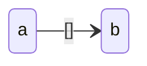

Now, if we have two machines

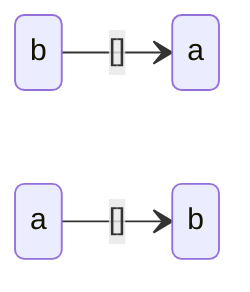

We can compose them like so

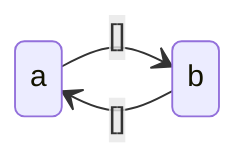

It works as follows. When an input `a` is received by the input machine, it is processed by the first machine to obtain a list of output `bs :: [b]`. These outputs as fed as inputs into the second machine one by one, obtaining a list of outputs `as :: [a]`. These outputs are then fed again to the first machine and the circle starts again, until one of the two machines emits the empty list `[]`. The composed machine will emit all the `bs` emitted in each round of the loop.

Notice that in fact everything works not only for lists, but for every foldable type.

## `Kleisli`

```haskell
Kleisli
  :: StateMachineT m a [b]
  -> StateMachineT m b [c]
  -> StateMachineT m a [c]
```

is very similar to `Sequential`, but it allows us to compose machines which emit multiple outputs.

Consider two machines

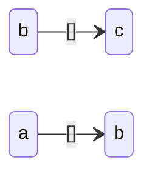

We can compose them

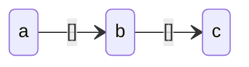

where the outputs `bs :: [b]` of the first machine are is passed as inputs to the second machine, and processed all one by one.

We used lists `[b]` here to denote multiple outputs, but we can in fact use any [`Foldable`](https://hackage.haskell.org/package/base/docs/Prelude.html#t:Foldable) type.

## `Basic`

All the other constructors are combinators to construct more complicated machine out of simpler ones. We still miss a way to build the simpler ones! That is exactly what the `Basic` constructor provides. It gives a way to create a machine by specifying precisely its internal behaviour.

```haskell
Basic
    :: forall vertex (topology :: Topology vertex) a b
     . ( Demote vertex ~ vertex
       , SingKind vertex
       , SingI topology
       , Eq vertex
       , Show vertex
       , RenderableVertices vertex
       )
    => BaseMachine topology a b
    -> StateMachine a b
```

To build a `StateMachine a b` using the `Basic` constructor, we need to build first a `BaseMachine topology a b` satisfying some constraints.

Let's start by understanding what `topology` represents.

### `Topology`

The `Topology` data type is defined as

```haskell
newtype Topology vertex = Topology
  {edges :: [(vertex, [vertex])]}
```

and represents a directed graph on a set of elements of type `vertex`.

It is indexed by a `vertex` type, and it is a newtype wrapper around a list, where every element of the list is a pair containing an element `a :: vertex` and a list of elements of type `vertex`. Every element `b :: vertex` in this last list means that there is an edge from `a` to `b`.

In practice, a `Topology` is a list of pairs, where every pair contains a vertex `a` and the list of vertices where an edge coming from `a` ends.

In fact, we use [`singletons`](https://hackage.haskell.org/package/singletons) to promote `Topology` to the type level and use it to keep track of the available machine transitions at the type level.

We use a `Topology vertex` kind, and we construct types of that kind using the `Topology :: [(vertex, [vertex])] -> Topology vertex` type constructor. In such a use, notice that also `vertex` is a kind.

#### Defining a `Topology`

To define a `Topology`, we first need to define the type of its vertices.

A straightforward approach is to define an enumeration of vertices, like

```haskell
data ExampleVertex
  = FirstVertex
  | SecondVertex
  | ThirdVertex
```

Next we want to describe which are the allowed transitions for our topology. We do this by listing them in the format described in the previous paragraph. For example

```haskell
exampleTopology :: Topology ExampleVertex
exampleTopology =
  Topology
    [ (FirstVertex, [SecondVertex, ThirdVertex])
    , (SecondVertex, [ThirdVertex])
    ]
```

This defines the following topology

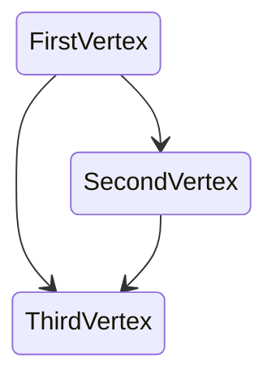

Since we need the topology information at the type level, we wrap the two type definitions in

```haskell
$( singletons
    [d|
      ...
    |]
 )
```

### Defining a `BaseMachine`

Now that we have our `exampleTopology`, we can learn how to define a `BaseMachine` where only the transitions listed in the topology are allowed.

A `BaseMachine topology a b` is index by its `topology`, the type `a` of its inputs and the type `b` of its outputs. In fact, there is another type which needs to be defined in order to implement a `BaseMachine` and that is the type of its possible states.

#### Describing the states space

To define the complete set of possible states of our machine, we need to say which are the possible states for every vertex of the topology.

To do this, we need to associate to every vertex the type of the states allowed for that vertex. We can achieve this by using a GADT like the following:

```haskell
data ExampleState (vertex :: ExampleVertex) where
  FirstVertexState :: Int -> ExampleState 'FirstVertex
  SecondVertexState :: String -> ExampleState 'SecondVertex
  ThirdVertexState :: Bool -> ExampleState 'ThirdVertex
```

This says that the first vertex will contain an `Int`, the second vertex a `String` and the third vertex a `Bool`.

Notice how we are using `ExampleVertex` as a kind and `'FirstVertex`, `'SecondVertex` and `'ThirdVertex` as types of that kind.

#### `Basic` constraints

The `Basic` constructor imposes several constraints on the `vertex` and the `topology` types to allow to perform the type-level tricks the library is currently using.

```haskell
( Demote vertex ~ vertex
, SingKind vertex
, SingI topology
, Eq vertex
, Show vertex
, RenderableVertices vertex
)
```

While `Eq vertex` and `Show vertex` do not require further explanation, let's try to provide a little more details and references for the other four.

The first three are required to [`demote`](https://hackage.haskell.org/package/singletons-3.0.2/docs/Data-Singletons.html#v:demote) a `topology` described at the type level, so that we can actually work with it at the value level.

##### `SingI topology`

The class [`SingI`](https://hackage.haskell.org/package/singletons-3.0.2/docs/Data-Singletons.html#t:SingI) is essentially a way to implicitly pass a singleton, which could be then retrieved with the `sing` function.

##### `SingKind vertex`

The [`SingKind`](https://hackage.haskell.org/package/singletons-3.0.2/docs/Data-Singletons.html#t:SingKind) class is a _kind_ class, and it classifies all kinds for which singletons are defined.

It supports converting between a singleton type and the base (unrefined) type which it is built from.

It is defined by a `Demote` associated type and two functions

```haskell
fromSing :: Sing (a :: k) -> Demote k
toSing :: Demote k -> SomeSing k
```

##### `Demote vertex ~ vertex`

The `demote` function, which allows us to bring information from the type level to the value level, actually returns a value of type `Demote (KindOf a)`. Hence, when we want to bring the type-level `topology` to the value level, and we do `demote @topology`, what we get is not a `Topology vertex`, but a `Demote (Topology vertex)`.

Since what we actually need is in fact a `Topology vertex`, we need to require that the two types are actually the same, and `Demote vertex ~ vertex` grants that and allows us to get a real `Topology` from the usage of `demote`.

This constraint is imposing some relevant restrictions to our `vertex` type.

If you take a look at the type instances for `Demote` (you can use `:i Demote` in `ghci` to see them), you will notice you have instances for `()`, `Bool` and `Ordering` and that you can combine then using `[]`, tuples, `Maybe` and `Either`. In practice this means that `vertex` needs to be (isomorphic to) a type built with just these types.

##### `RenderableVertices vertex`

The `RenderableVertices` class is defined by the project as such

```haskell
class RenderableVertices a where
  vertices :: [a]
```

It is used to list all the vertices of type `a` so that they can be rendered.
It has a default instance for types `a` satisfying `(Enum a, Bounded a)`, but you can overwrite it for more specific types.

Be aware that rendering a graph or topology with vertices of type `a` will try to print out every element of that type. It might not be a good idea to try to print out every value of type `Int`, for example...

#### Implementing the machine logic

Now that we have defined all the relevant types (i.e. the topology, the state, the input and the outputs of the machine), we can eventually define its internal logic.

A `BaseMachine` requires two things to be defined, its initial state and its action logic, which defines how to evolve the state and which output should be emitted when an input is received.

##### Defining the initial state

The initial state has type `InitialState state`, which is defined as

```haskell
data InitialState (state :: vertex -> Type) where
  InitialState :: state vertex -> InitialState state
```

The `state` parameter is a type of kind `vertex -> Type`. It has a single constructor which requires a value of type `state vertex`.

In our example, we need to define a value of type `InitialState ExampleState` (`ExampleState` is a type of kind `ExampleVertex -> Type`, so it fits perfectly!). Hence, we need a value of type `ExampleState vertex` to construct it. Since `ExampleState` has three constructors, we have three options:

- storing an `Int` in the first vertex, with `FirstVertexState`
- storing a `String` in the second vertex, with `SecondVertexState`
- storing a `Bool` in the third vertex, with `ThirdVertexState`

For the sake of the example, let's say we pick the first option, and we define

```haskell
initialState = InitialState $ FirstVertexState 42
```

##### Defining the action logic

The last thing we need to define is how the machine should react to receiving an input. This is described by the `action` field which has the following type

```haskell
action
  :: state initialVertex
  -> input
  -> ActionResult m topology state initialVertex output
```

In practice, for every possible state and received input, we need to define the final state and the emitted output. The type is a bit fancier because it is actually constraining the state transition to respect the `topology`. If we try to implement a transition which is not allowed by the topology, the code will simply fail to compile. Apart from that, `ActionResult` is just a newtype around a pair `(output, state finalVertex)`.

Concluding our example, we could implement action as follows

```haskell
action = \case
  FirstVertexState i -> \input ->
    if i > 10
      then ActionResult (_, SecondVertexState (_ :: String))
      else ActionResult (_, ThirdVertexState (_ :: Bool))
  SecondVertexState s -> \input ->
    ActionResult (_, ThirdVertexState (_ :: Bool))
  ThirdVertexState b -> \input ->
    ActionResult (_, ThirdVertexState (not b))
```

where we left some holes, which can be freely filled depending on the output type and the logic of the machine.

Notice that for the third vertex, we implemented our machine so that every transition would just end up in the same vertex. Such a transition is not explicitly included in our `ExampleTopology`. This still works because every trivial transition from a vertex to itself is always allowed.
